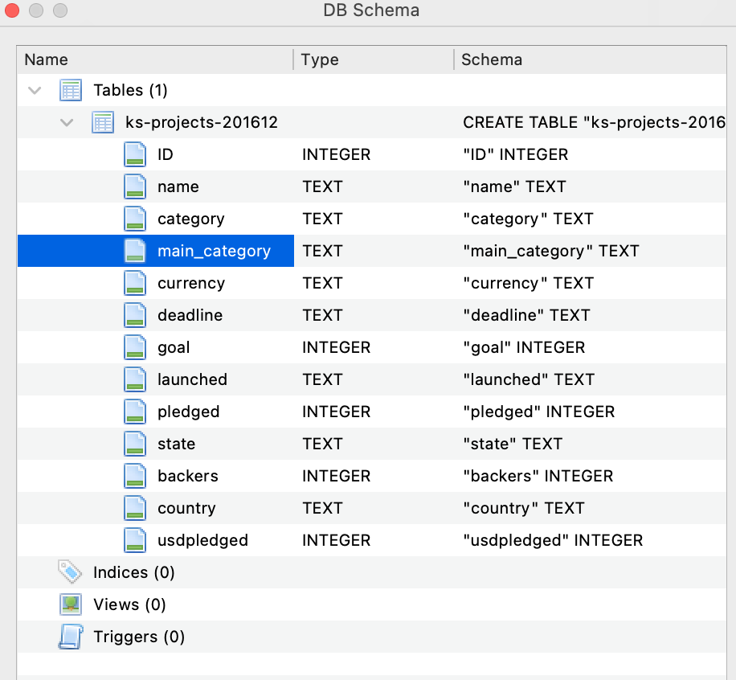

# 📊 Kickstarter Projects SQL Analysis

A simple SQL project analyzing data from the [Kickstarter Projects dataset](ks-projects-201612.csv.zip) using SQLite. This project explores various patterns in successful and failed Kickstarter campaigns by writing SQL queries and documenting the insights.

---

## 📁 Dataset Information

- **Source:** [Kaggle - Kickstarter Projects Dataset]([https://www.kaggle.com/](https://www.kaggle.com/datasets/kemical/kickstarter-projects?resource=download&select=ks-projects-201801.csv))
- **Size:** `46.5 MB` (update accordingly)
- **Records:** `323,750` rows
- **Fields:**

---

## 🛠️ Tools & Technologies

- SQL (SQLite )*
- DB Browser 
-  SQL IDE
-  GitHub for  documentation

---

## 🔍 Project Objectives

- Understand the structure of the Kickstarter dataset
- Perform data cleaning and basic EDA using SQL
- Write SQL queries to answer key questions, such as:
  - What categories have the highest success rate?
  - What is the average goal of failed vs. successful projects?
  - How do countries and launch years affect project success?

---

## 📌 Folder Structure

